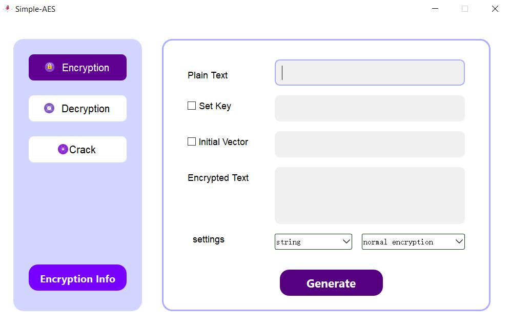

# Simple_AES

English | <a href='./docs/README.zh-CN.md'>简体中文</a>

This is a homework of the CQU course - introduction of information security.

**The ./docs directory stores relevant test results, user manuals and development manuals required by the task.**

The functions completed by this project are as follows:
1. Basic Test  
Write and debug programs based on the S-AES algorithm, and provide GUI decryption to support user interaction. The input can be 16bit data and 16bit key, and the output is 16bit ciphertext.

2. Cross Test  
Considering it is an "algorithm standard", the same algorithm flow and conversion units (replacement boxes, column confusion matrices, etc.) need to be used when writing programs to ensure that algorithms and programs can run normally on heterogeneous systems or platforms. Suppose there are two groups of students A and B (select the same key K); then the programs written by students in groups A and B encrypt the plain text P and obtain the same ciphertext C; or students in group B receive the program encrypted by group A. Ciphertext C can be decrypted using group B program to obtain the same P as A.

3. Extensions  
Considering the expansion to practicality, the data input of the encryption algorithm can be an ASII encoded string (grouped into 2 Bytes), and the corresponding output can also be an ACII string (most likely garbled).

4. Multiple Encryption  

- Double Encryption:
The S-AES algorithm is extended through double encryption. The block length is still 16 bits, but the key length is 32 bits.

- MITM Attack:
Assuming that you find one or more plaintext and ciphertext pairs using the same key, please try to use the meet-in-the-middle attack method to find the correct key Key (K1+K2).

- Troupe Encryption:
Use 48bits (K1+K2+K3) mode for triple encryption and decryption.

5. Working Mode  
Based on the S-AES algorithm, longer plaintext messages are encrypted using Cipher Block Chaining (CBC) mode. Note that the initial vector (16 bits) is generated and needs to be shared by both encryption and decryption parties. Encrypt in CBC mode, try to replace or modify the ciphertext group, and then decrypt. Please compare the decryption results before and after tampering with the ciphertext.

The program interface is as follows:



Quickly deploy and start (make sure your computer has python and git installed before):

```
git clone https://github.com/Jiewoe/Simple_AES.git
cd Simple_AES
pip install -r requirements.txt
python main.py
```
